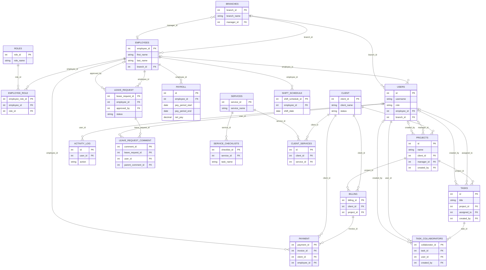

# Item 17 - Final ERD (Consistent with Current Implementation)

Source of truth used:
- `database/Capstone1.sql`

## Notes for Panel

- The ERD above focuses on the modules used in the 40 percent completion checklist.
- All relationship lines are mapped from existing foreign keys in `database/Capstone1.sql`.
