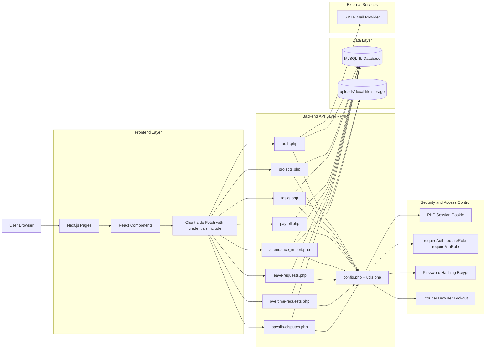
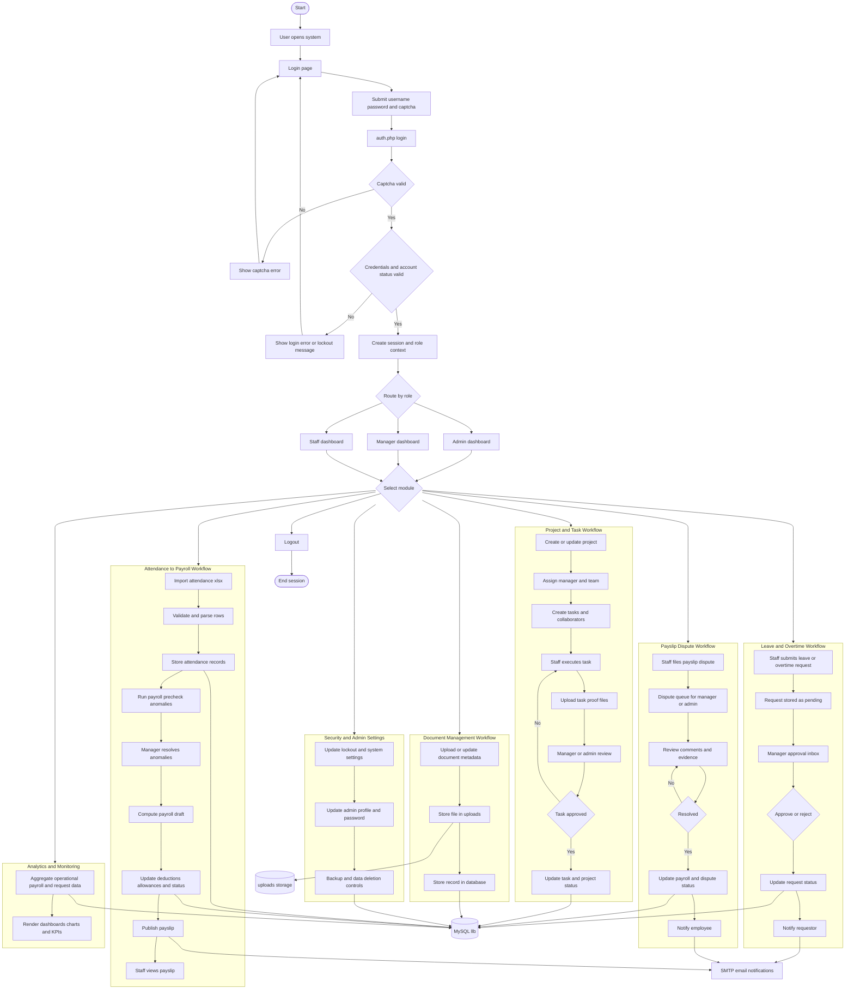

# Item 18 - System Architecture Diagram

This architecture matches the current project stack:
- Frontend: Next.js (React, TypeScript)
- Backend: PHP API endpoints (`/api/*.php`)
- Database: MySQL (`llb`)
- Storage: local uploads folder
- External: SMTP mail service

## End-to-End Transaction Path Example

1. User logs in from browser on Next.js login page.
2. Frontend calls `api/auth.php?action=login` with session credentials.
3. Backend validates captcha, password hash, and role, then opens session.
4. User submits data in module form (for example payroll or task).
5. Frontend calls target API endpoint (`payroll.php`, `tasks.php`, etc.).
6. Backend validates input, enforces RBAC, writes to MySQL, logs activity, and returns JSON response.
7. Frontend refreshes table/list and displays updated output.

## End-to-End Functional Flowchart (Assumed Fully Functional)

